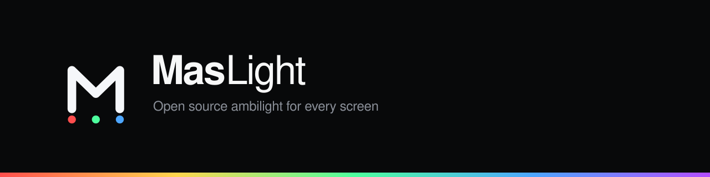

<p align="center">
  
</p>

<p align="center">
  <a href="LICENSE"></a>
  
  
  
</p>

**Turkish: [README.tr.md](README.tr.md)**

MasLight drives an addressable LED strip from what is on your screen. It speaks
WLED UDP, DDP, sACN, Art-Net and Adalight, it runs on Windows and Linux, and
everything stays on your own machine.

> **Status: 0.1.0.** The Windows path is complete and verified on real
> hardware: capture, the colour pipeline and UDP output all run end to end. The
> Linux X11 backend compiles and is written, but has not yet been run on a
> Linux machine. Wayland is half done and the [Linux page](docs/linux.md)
> explains exactly which half.

## Why this exists

Prismatik is what most people used for this, and today it is effectively
Windows only: the Linux build binds to X11 and does nothing in a Wayland
session, which is what Ubuntu and most current desktops boot into. Hyperion is
cross platform but heavy to set up.

MasLight is the replacement, and it aims to be better at three things
specifically:

**Wayland.** The portal handshake is implemented, including the restore token
that stops the consent dialog appearing on every start.

**HDR.** With Windows HDR on, Desktop Duplication hands back half float scRGB.
MasLight decodes it and tone maps the highlights instead of clipping every
bright scene to white.

**Calibration.** A wizard that sends pure red and asks what colour the strip
actually shows, so nobody has to guess whether their chip is GRB or RGB. And
one that finds the LEDs with a camera: photograph eight patterns and both the
positions and the wiring order come out of the photographs, so nobody has to
describe their strip at all.

## What it does

* **Screen capture ambilight** with a colour pipeline that stays in linear
  light from the first pixel to the last byte.
* **Audio reactive mode.** Loopback capture of whatever your speakers are
  playing, a log spaced spectrum, beat detection, four effects, and a blend
  control so music can take over part of the strip while the screen keeps the
  rest.
* **Free form layout editor.** Generate a layout from the LED count on each
  edge, then drag individual LEDs. Multiple monitors, off screen LEDs, gaps in
  the chain, reversed strips and RGBW are all part of the model.
* **Every common protocol**, with unit tests asserting the exact bytes on the
  wire: WLED UDP, DDP, sACN, Art-Net, Adalight, TPM2, OpenRGB, and MQTT for
  home automation.
* **Automatic device discovery** over mDNS, then a question to the controller
  about how many LEDs it drives.
* **Rules that switch profiles on their own**: a running program, something
  fullscreen, a time range, or running on battery.
* **A local REST and WebSocket API**, on loopback, behind a token, off until
  you turn it on.
* **Scripted effects** in a sandbox that cannot reach your files, your network,
  or hang the lights.
* **Light on the machine.** A still screen drops the capture rate on its own,
  and even at full speed the readback is a small image rather than a whole
  desktop.
* **Nothing leaves your machine.** No account, no analytics, no crash
  reporting. Update checking is off by default.

## Install

Grab a package from [Releases](https://github.com/maslight/maslight/releases),
or see [the install page](docs/install.md).

Then: scan for your controller, enter the LED count for each screen edge, and
run the three step calibration. Ten minutes from a dark strip to a working one.

## Build

```sh
git clone https://github.com/maslight/maslight
cd maslight
npm install --prefix app
npm run build --prefix app
cargo run -p maslight-app
```

Working on the interface alone needs no Rust at all: `npm run dev --prefix app`
serves it with a demo backend, so every screen is reachable without hardware.

Toolchain details, including a Windows build that needs no Visual Studio, are
in [building from source](docs/building.md).

## How it is put together

```text
capture backend  ->  zone reducer  ->  colour pipeline  ->  sink
   (platform)         (per LED)          (per frame)       (bytes)
```

| Crate | Contents |
|---|---|
| `maslight-core` | Colour pipeline, layout model, zone reducer, profiles. No platform code. |
| `maslight-capture` | `CaptureBackend` trait plus DXGI, X11, PipeWire and a synthetic source. |
| `maslight-output` | `Sink` trait plus WLED, DDP, sACN, Art-Net, serial, discovery. |
| `maslight-audio` | Loopback capture, spectrum analysis, beat detection, effects. |
| `maslight-rules` | Automatic profile switching and the platform probes it needs. |
| `maslight-api` | The local REST and WebSocket server. |
| `maslight-effects` | The sandboxed Rhai runtime for scripted effects. |
| `maslight-calibrate` | Camera assisted position discovery and the homography it needs. |
| `maslight-engine` | The loop, profiles, telemetry, latency compensation. |
| `app/` | Tauri shell and the React interface. |

Two design decisions carry most of the weight, and both are explained in
[how it works](docs/architecture.md):

**Averaging happens in linear light.** A half black, half white screen averages
to a mid grey that really is half as bright. Averaging sRGB codes instead gives
you something more than twice too bright, which is why some ambilight software
looks washed out.

**The GPU does the downscale.** On Windows the desktop goes into a texture with
a full mip chain, the GPU builds the pyramid, and MasLight reads back a small
mip: a 1920x1080 desktop comes back as 240x135. Sixty four times less data over
the bus, and the box filter that made the mip is exactly the average the LEDs
want.

## What is not done yet

Being plain about this matters more than a longer feature list:

* **Wayland capture** stops after the portal handshake. The PipeWire reader is
  written but has never been compiled on Linux, which is why it sits behind a
  feature flag.
* **macOS** has no capture backend. The app builds, but there is nothing to
  capture. That is the 0.3 milestone.
* **Serial output** is implemented and unit tested, but behind a feature flag
  and not yet exercised against real hardware.

## Documentation

* [Installing](docs/install.md)
* [Linux: X11 and Wayland](docs/linux.md)
* [The audio mode](docs/audio.md)
* [The local API](docs/api.md)
* [Scripted effects](docs/scripting.md)
* [Output protocols](docs/protocols.md)
* [The layout model](docs/layout.md)
* [Camera discovery](docs/discovery.md)
* [Building from source](docs/building.md)
* [How it works](docs/architecture.md)

## Contributing

See [CONTRIBUTING.md](CONTRIBUTING.md). The short version: `cargo test
--workspace --exclude maslight-app` should pass, `cargo clippy -- -D warnings`
should be quiet, and a new protocol needs a test that asserts its bytes.

## Licence

MIT. See [LICENSE](LICENSE).
