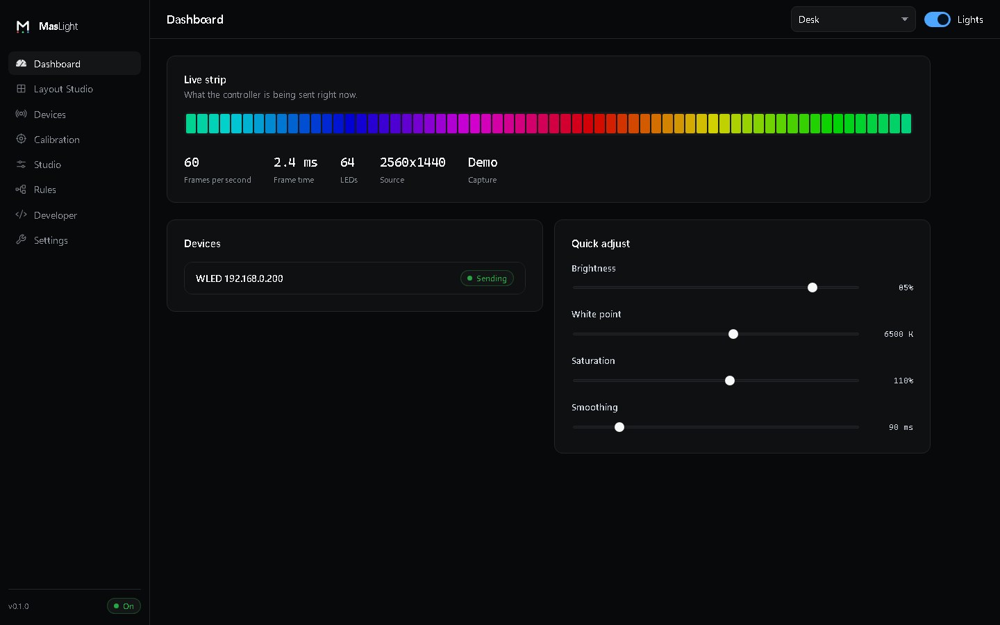
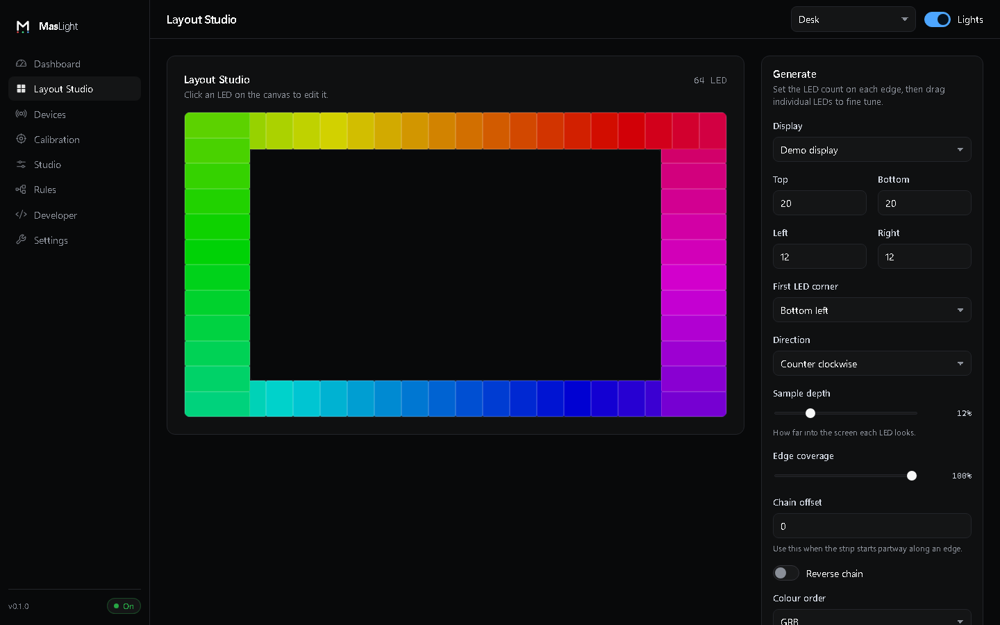
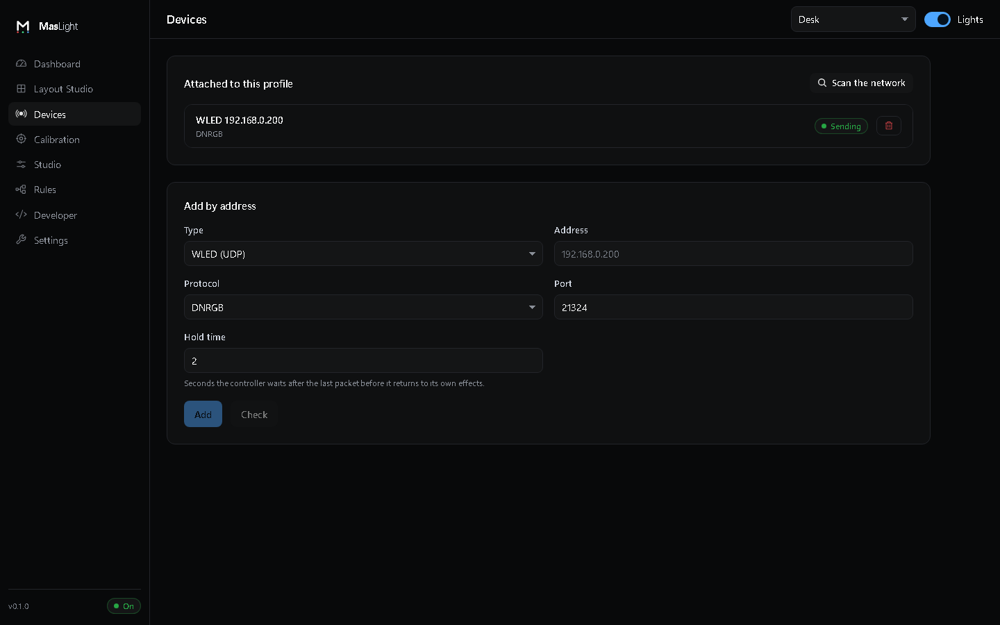
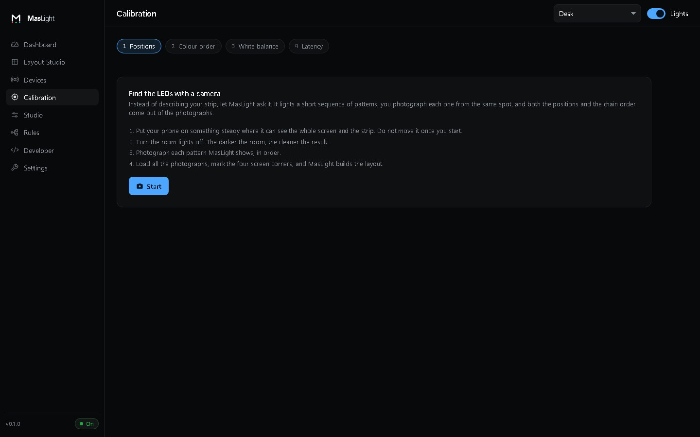
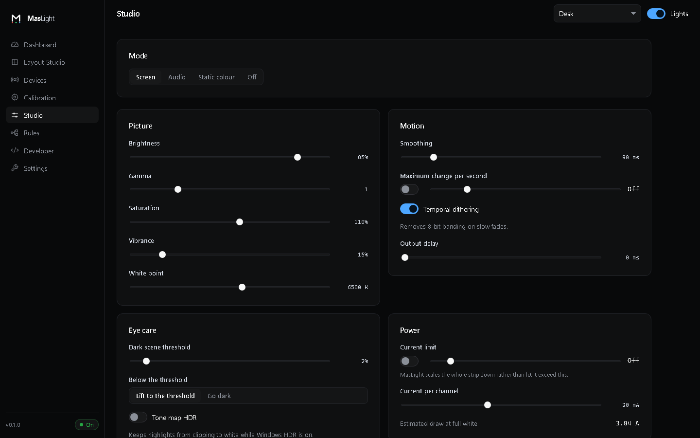
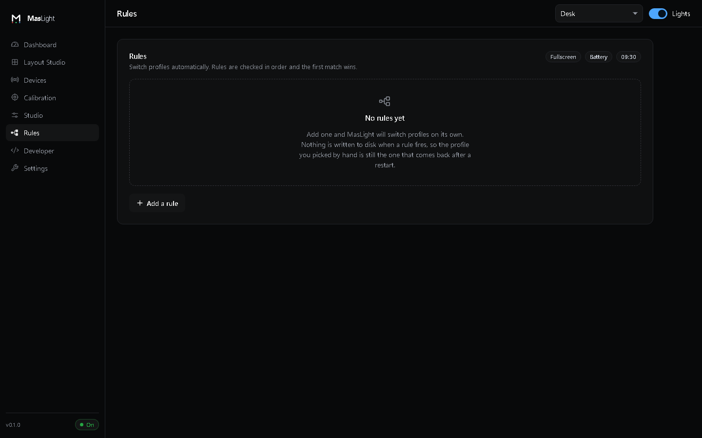
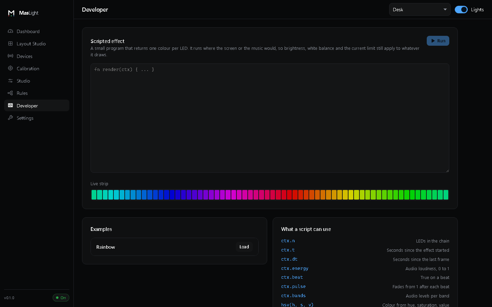
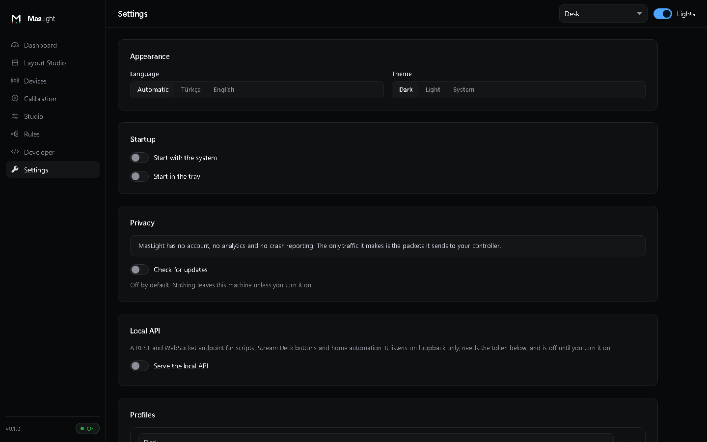

# The interface

Eight screens. Every one of these is a real screenshot of the running
application, not a mockup, and they are regenerated from the app itself rather
than drawn by hand.

## Dashboard

What is on the strip right now, and the numbers that tell you whether it is
healthy: frames per second, frame time, LED count, capture source. The strip
preview is the actual frame being sent, so if the lights look wrong this is
where you see whether the problem is upstream or downstream of the pipeline.



## Layout Studio

Where the LEDs live. The wizard generates a layout from four edge counts, a
starting corner and a direction; after that every LED can be dragged, resized
or switched off individually. Positions are stored normalised to the screen,
so changing resolution does not break a layout.



## Devices

Controllers, the protocol each one speaks, and whether packets are actually
arriving. "Sending" and "No answer" are separate states on purpose: a sink
that is transmitting into a void looks exactly like a working one unless
something checks.



## Calibration

Four wizards: find the controller, find the colour order, find the LED
positions with a camera, and measure the delay. See
[camera discovery](discovery.md) for how the position pass works.



## Studio

The colour pipeline, exposed. Brightness, gamma, saturation, vibrance and white
point on one side; smoothing, rate limiting, dithering and output delay on the
other; then the eye care floor and the power limit, which shows the estimated
draw at full white so the number means something before you trust it.



## Rules

Profile switching without touching the app: a running program, a fullscreen
window, a time range, or running on battery. Rules are ordered and the first
match wins, which is why they can be moved up and down.



## Developer

The [Rhai](scripting.md) editor with a live preview of what the script puts on
the strip, the API token, and the event console. Scripts run in a sandbox that
cannot reach the filesystem or the network and cannot hang the lights.



## Settings

Language, theme, startup behaviour, and the two things worth being explicit
about: MasLight contains no account, no analytics and no crash reporting, and
update checking is off until you turn it on.



## Regenerating these

The app reads a fragment on startup, so each screen can be opened directly.
With the dev server running:

```bash
for s in dashboard layout devices calibration studio rules developer settings; do
  chrome --headless=new --hide-scrollbars --force-color-profile=srgb \
    --lang=en-US --virtual-time-budget=6000 --window-size=1440,900 \
    --screenshot="assets/screenshots/$s.png" "http://localhost:5173/#$s"
done
```
